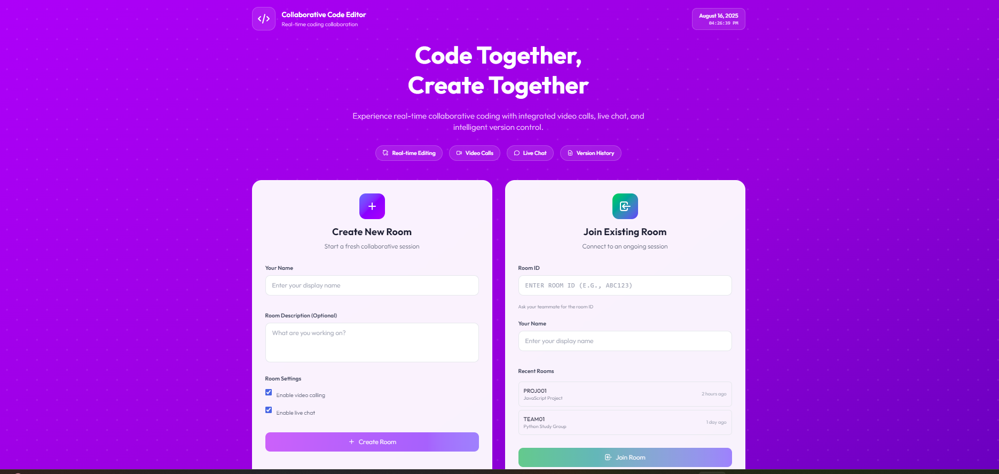
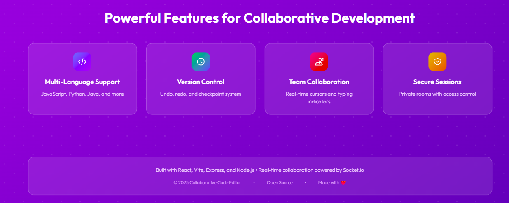

# Backend - Collaborative Code Editor

This backend is structured using the **MVC (Model-View-Controller)** architecture pattern for better organization, maintainability, and scalability.

---

## ⚙️ Requirements
- **Node.js v18+**
- **npm v8+**
- A modern browser (Chrome / Firefox / Edge)

---

## 📦 Installation

### 1️⃣ Clone the Repository
```bash
git clone https://github.com/Kushika-Agarwal/Collaborative-code-editor.git
cd Collaborative-code-editor/backend

2️⃣ Install Dependencies
npm install

3️⃣ Start the Server
# Development mode with auto-restart
npm run dev

# Production mode
npm start


Server will start on 👉 http://localhost:3000

🖼️ Demo
## 📸 Screenshots

### 🏠 Home Page


### 🚀 Features Page



🏗️ Architecture Overview
backend/
├── config/           # Configuration files
├── controllers/      # Business logic handlers
├── middleware/       # Express middleware
├── models/           # Data models
├── routes/           # Route definitions
├── services/         # Business logic services
└── server.js         # Main server file

📁 Directory Structure
config/

database.js - Database configuration and in-memory storage management

server.js - Server configuration (CORS, ports, etc.)

controllers/

RoomController.js - Handles room-related socket events and business logic

VideoCallController.js - Handles video call-related socket events

middleware/

errorHandler.js - Global error handling middleware

logger.js - Request and socket logging middleware

models/

Room.js - Room data model with methods for room operations

User.js - User data model with methods for user operations

routes/

httpRoutes.js - HTTP REST API endpoints

socketRoutes.js - Socket.IO event handlers

services/

RoomService.js - Business logic for room operations

UserService.js - Business logic for user operations

🔄 Data Flow

Socket Events → routes/socketRoutes.js → controllers/ → services/ → models/

HTTP Requests → routes/httpRoutes.js → controllers/ → services/ → models/

🚀 Features
Real-time Collaboration

Multiple users can join the same room

Live code synchronization

Typing indicators

Language selection

Chat System

Real-time messaging within rooms

Message history (last 50 messages)

User identification

Video Calling

WebRTC-based video calls

Camera and microphone controls

Call room management

Signaling for peer connections

API Endpoints

Health check: GET /health

Room statistics: GET /api/rooms/stats

Call statistics: GET /api/calls/stats

Room info: GET /api/rooms/:roomId

API docs: GET /api/docs


🛠️ Development
Starting the Server
# Development mode with auto-restart
npm run dev

# Production mode
npm start

API Testing
# Health check
curl http://localhost:3000/health

# Room statistics
curl http://localhost:3000/api/rooms/stats

# Call statistics
curl http://localhost:3000/api/calls/stats


📊 Monitoring

The application includes built-in logging and monitoring:

Request/response logging

Socket connection tracking

Error handling and reporting

Room and user statistics


🔧 Configuration

Server configuration can be modified in config/server.js:

Port settings

CORS configuration

Static file serving

Socket.IO settings


🚨 Error Handling

Global error handler middleware

Socket error logging

Graceful shutdown handling

404 route handling


📈 Scalability

The current structure supports:

Easy addition of new features

Database integration (replace in-memory storage)

Microservices architecture

Load balancing

Horizontal scaling


🔒 Security Considerations

CORS configuration for production

Input validation (to be implemented)

Rate limiting (to be implemented)

Authentication (to be implemented)


🤝 Contributing

Fork the repo

Create a new branch (git checkout -b readme-improvements)

Commit your changes (git commit -m "docs: improve backend README")

Push to the branch (git push origin readme-improvements)

Open a Pull Request 🎉

📜 License

MIT License © 2025 Kushika Agarwal & Contributors
